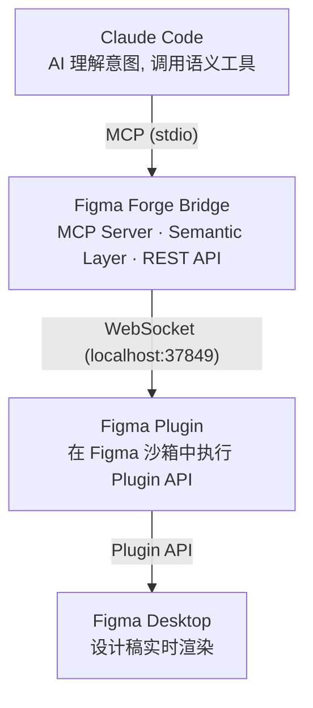
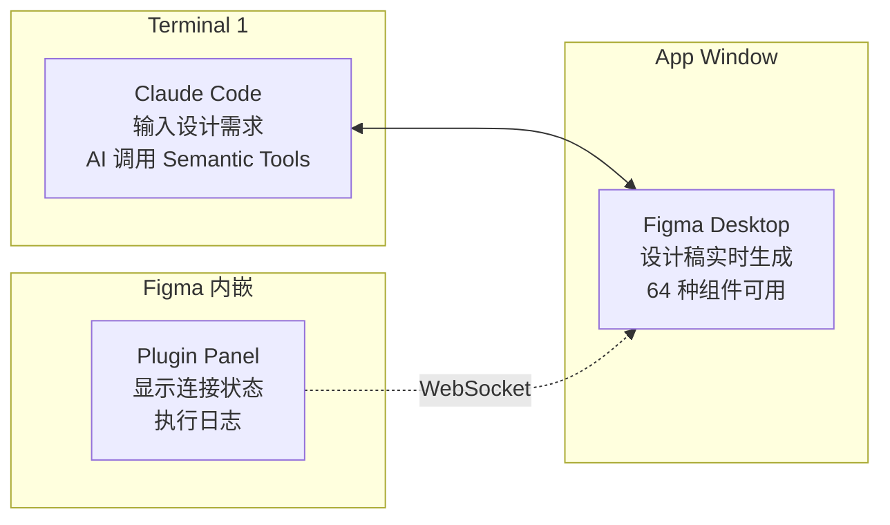

# Figma Forge

<p align="center">
  
</p>

<p align="center">
  <strong>AI 驱动的 Figma 设计引擎</strong> — 让 Claude Code 直接在 Figma 中创造设计稿。
</p>

<p align="center">
  <a href="#"></a>
  <a href="#"></a>
  <a href="#"></a>
  <a href="#"></a>
</p>

<p align="center">
  <code>Claude Code</code> → <code>MCP</code> → <code>Bridge Server</code> → <code>WebSocket</code> → <code>Figma Plugin</code>
</p>

---

## 为什么需要 Figma Forge

| 痛点 | 现状 | Figma Forge |
|------|------|-------------|
| 官方 API 限流 | 120 req/min，复杂文件频繁 429 | Plugin API，**无调用限制** |
| 只能读不能写 | REST API 单向 | 完整的创建 / 修改 / 删除 |
| 每次调用走网络 | 高延迟、易超时 | WebSocket 本地通信，**毫秒级响应** |
| 手动设计效率低 | 重复操作、无法批量 | AI 一次指令，**64 个语义工具自动编排** |

## 架构



**核心设计**：AI 只说"做什么"（`create_button({ variant: "primary" })`），Bridge 负责"怎么做"（自动编排 createNode → setLayout → createText）。一次 Tool Call 完成复杂设计操作。

---

## 特性一览

<details>
<summary><b>🎨 设计创建</b> — 26 个语义工具</summary>

一次调用即可生成完整的 UI 组件，无需手动拼装底层 API。

| 类别 | 工具 |
|------|------|
| 基础 | `create_container` · `create_text` |
| UI 组件 | `create_button` · `create_card` · `create_input` · `create_avatar` · `create_icon` · `create_image` · `create_divider` · `create_badge` |
| 布局 | `create_header` · `create_sidebar` · `create_grid` · `create_list` · `create_form` · `create_modal` · `create_toast` · `create_navigation` · `create_hero` |
| 曲线与矢量 | `import_svg` · `create_path` · `create_arc` · `create_wave` · `create_bezier_curve` · `create_custom_shape` · `trace_image` |

</details>

<details>
<summary><b>✏️ 设计修改</b> — 6 个语义工具</summary>

支持按 ID 精确操作，也支持按语义标签批量操作。

| 工具 | 说明 |
|------|------|
| `update_node` / `update_by_semantic` | 更新属性（单个 / 批量） |
| `delete_node` / `delete_by_semantic` | 删除节点（单个 / 批量） |
| `move_node` / `reorder_by_semantic` | 移动与重排 |

</details>

<details>
<summary><b>🔍 设计读取</b> — 6 个语义工具</summary>

| 工具 | 说明 |
|------|------|
| `get_document_info` | 文档名称、页面列表 |
| `get_node_tree` | 递归获取节点层级 |
| `get_node_properties` | 获取节点属性 |
| `find_nodes` | 按名称 / 类型 / 语义搜索 |
| `get_styles` | 样式信息 |
| `get_semantic_map` | 语义注册表 |

</details>

<details>
<summary><b>🏗️ 高级能力</b> — 设计 Token · 变体 · Diff · 模板 · 布局计算</summary>

| 能力 | 工具 | 说明 |
|------|------|------|
| Layout | `set_layout` · `set_position` | Auto Layout 配置与绝对定位（含 6 种预设：centered, stretch-fill, hug-content, sidebar-left, stack-vertical, grid-cell） |
| Layout 计算 | `calculate_layout` · `fit_to_children` · `check_bounds` | 纯计算（无 Figma 交互）+ 容器自适应 + 边界校验（可自动修复） |
| Variables | `create_variable_collection` · `create_variable` · `get_variables` · `update_variable` · `delete_variable` | 设计 Token CRUD，支持 light/dark 多模式 |
| Variants | `create_component_set` · `create_variant_instance` · `update_variant` · `get_component_sets` | 组件变体的创建与实例化 |
| Diff Engine | `diff_snapshot` · `diff_apply` | 增量更新，只发送变化的属性 |
| Templates | `create_from_template` · `list_templates` · `save_as_template` | 预定义模板 + 参数化生成 |
| Batch | `batch_execute` | 批量执行，失败可选回滚 |
| Events | `start_event_listener` · `stop_event_listener` · `get_pending_events` | 实时监听文档变化 |
| Export | `export_node` · `export_by_semantic` | 导出为 PNG / JPG / SVG / PDF |

</details>

---

## 快速开始

### 前置条件

| 依赖 | 版本 | 说明 |
|------|------|------|
| **Figma Desktop** | — | ⚠️ Web 版不支持 Plugin API |
| Node.js | ≥ 18 | 运行 Bridge Server |
| Claude Code | — | CLI 或 VS Code 插件均可 |

### 安装

**方式一：从 npm（推荐）**

```bash
npx @figma-forge/core setup
```

**方式二：从源码**

```bash
git clone <repo-url> && cd Figma-Forge
pnpm install && pnpm build
```

### 在 Figma 中导入 Plugin

1. 打开 **Figma Desktop**（不是 Web 版）
2. `Plugins` → `Development` → `Import plugin from manifest...`
3. 选择文件：
   - npm 安装 → `~/.figma-forge/plugin/manifest.json`
   - 源码安装 → `packages/plugin/manifest.json`

### 开始使用

```bash
# 在项目目录启动 Claude Code（它会自动启动 Bridge Server）
cd <your-project>
claude
```

在 Figma 中右键 → Plugins → Figma Forge，看到 **"Connected to Bridge"** 后即可对话：

```
你: 帮我创建一个登录页面
Claude: (调用 create_form → create_button → create_input，Figma 中实时生成)
```

> **⚠️ 不要手动启动 Bridge Server。** Claude Code 通过 `.mcp.json` 自动管理其生命周期，手动启动会导致端口冲突。

### 提升体验的小技巧

1. **设置快捷键**：`Figma → Settings → Keyboard shortcuts → Plugins → Figma Forge`，绑定一个顺手的组合键（如 `Ctrl+Shift+F`），每次打开 Figma 一键启动。
2. **保持面板常驻**：Plugin 面板启动后不要关闭，WebSocket 连接会一直保持。只要 Figma 不退出，整个会话期间只需启动一次。
3. **自动重连**：如果 Bridge Server 重启，Plugin 会自动尝试重连（最多 20 次，3 秒间隔），无需手动操作。

---

## 工作区布局

使用时需要三个窗口同时工作：



Bridge Server 由 Claude Code 在后台自动启动，无需额外操作。

---

## 开发

```bash
pnpm build                  # 构建所有包
pnpm dev:bridge             # 单独调试 Bridge（⚠️ 不要和 Claude Code 同时使用）
```

## 技术栈

| 层级 | 技术 |
|------|------|
| Plugin | TypeScript · Figma Plugin API |
| Bridge | TypeScript · Node.js · `@modelcontextprotocol/sdk` · WebSocket (`ws`) · Zod · imagetracerjs |
| 构建 | esbuild + tsc · pnpm monorepo |

## REST API

Bridge Server 同时提供 HTTP 接口，可作为 MCP 的补充：

```bash
curl http://localhost:37850/health                                    # 健康检查
curl -X POST http://localhost:37850/tools/get_document_info           # 获取文档信息
curl -X POST http://localhost:37850/tools/create_container \
  -H "Content-Type: application/json" \
  -d '{"name": "my-frame", "direction": "VERTICAL", "padding": 16}'  # 创建容器
```

---

## 故障排查

| 问题 | 排查步骤 |
|------|---------|
| **Plugin 显示 "Disconnected"** | ① 确认 Figma Desktop（非 Web） ② 确认 Claude Code 已启动 ③ 查看终端是否有 `[Bridge] ✅ Plugin connected` ④ 在 Plugin 面板等待自动重连 |
| **MCP server failed to start** | ① `node --version` ≥ 18 ② 在 `.mcp.json` 所在目录启动 Claude Code ③ 确认 `pnpm build` 已执行 |
| **端口冲突 EADDRINUSE** | 不要同时手动启动 Bridge 和 Claude Code。查找占用进程：`lsof -i :37849`（macOS/Linux）或 `netstat -ano \| findstr :37849`（Windows） |
